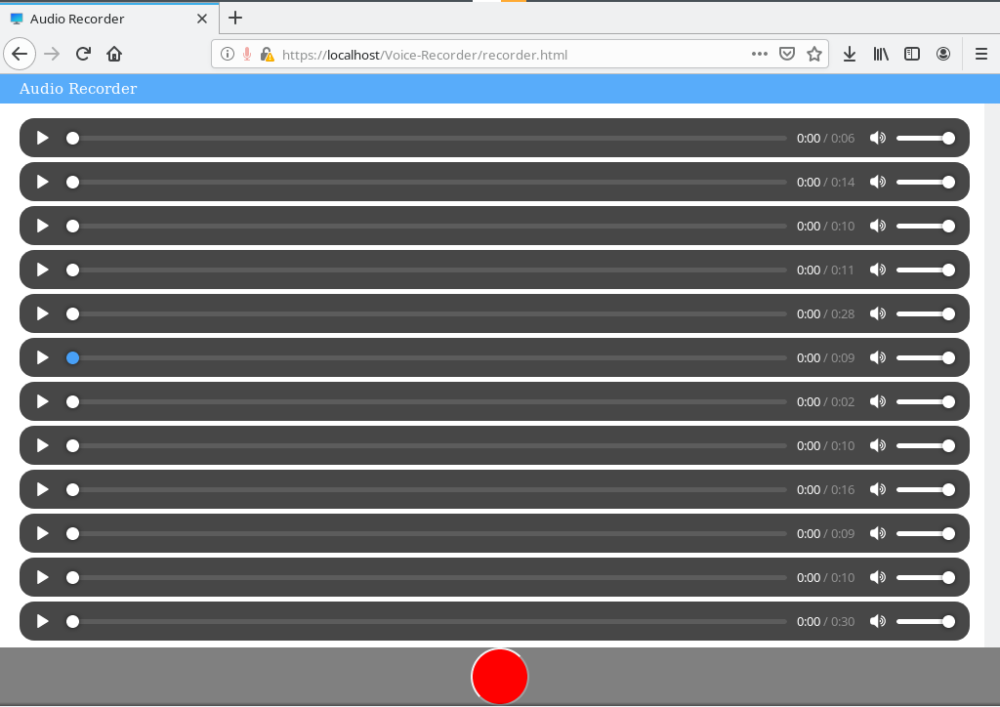
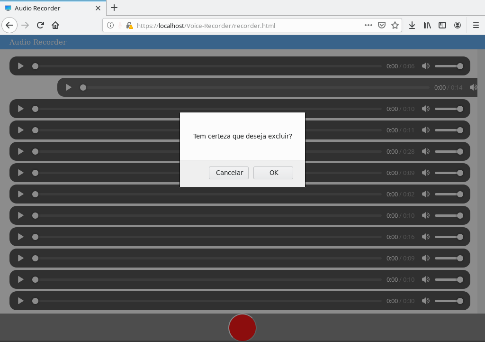
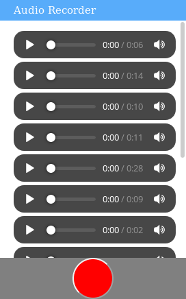
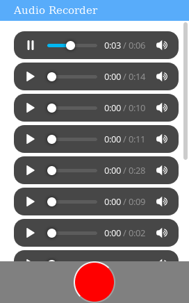

# Audio Recorder
Grave áudio com javascript e envie para um servidor com PHP. Tudo isso por meio de uma interface simples e intuitiva.
## Instalação
Para instalar copie a pasta do projeto para o servidor. Não requer nenhum requisito adicional do servidor além do PHP atualizado.
## Capturas

## Detalhes adicionais
Este sistema não usa banco de dados. Os arquivos de gravação são armazenados no servidor sem nenhuma segurança ou criptografia. O gerenciamento das gravações é feito em um arquivo TXT simples. O sistema não possui autenticação implementada. Para deletar uma gravação basta delizar a mesma para o lado direito. O toque/clique deve iniciar fora do player de audio do lado esquerdo.
